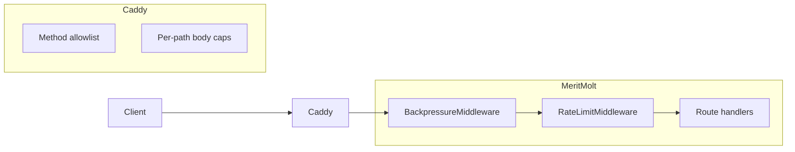

# Part 4 Design: Rate Limiting + Backpressure

This document records the main design decisions and reasons for MeritMolt Part 4: inbound rate limiting (token-bucket per principal per route group) and backpressure (concurrency semaphores, request deadline for reads), plus optional coarse Caddy hardening.

---

## Overview

Inbound requests pass through Caddy (coarse protection only), then two pure ASGI middleware layers in order: **BackpressureMiddleware** (concurrency + deadline) then **RateLimitMiddleware** (token bucket per key per route group). Route handlers run only if both layers allow the request.



- **Backpressure:** Request ID, global + per-group semaphore (1s timeout → 503 overloaded), and for `reads` only a per-request deadline (→ 503 deadline_exceeded).
- **Rate limit:** Classify path → choose key (IP or JWT `sub`) → token bucket try_acquire → 429 rate_limited if over limit.

### Route groups and path mapping

| Group         | Paths / pattern              | Rate-limit key | Default limit (env)        |
|---------------|------------------------------|----------------|-----------------------------|
| `auth_login`  | `/v1/auth/login`             | Client IP      | 30/hour                     |
| `auth_refresh`| `/v1/auth/refresh`, `/v1/auth/logout` | Client IP | 10/min                      |
| `writes`      | `/v1/events/*`              | JWT `sub`      | burst 20, sustain 60/min     |
| `reads`       | `/v1/scores/*`, `/v1/rank/*`, `/v1/auth/me` | JWT `sub` | burst 60, sustain 300/min   |
| `exempt`      | `/`, `/health`, `/db`       | —              | no rate limit               |

### Config (environment)

| Variable | Default | Description |
|----------|---------|-------------|
| `MM_RL_AUTH_LOGIN_LIMIT` | 30 | Requests per hour per IP (login) |
| `MM_RL_AUTH_REFRESH_LIMIT` | 10 | Requests per minute per IP (refresh/logout) |
| `MM_RL_WRITES_BURST` / `MM_RL_WRITES_SUSTAIN` | 20 / 60 | Token bucket for writes |
| `MM_RL_READS_BURST` / `MM_RL_READS_SUSTAIN` | 60 / 300 | Token bucket for reads |
| `MM_RL_BUCKET_MAX_KEYS` / `MM_RL_BUCKET_TTL_SECONDS` | 10000 / 3600 | LRU store cap and TTL |
| `MM_RL_REDIS_URL` | (none) | Optional; future shared storage for multi-instance |
| `MM_BP_GLOBAL_MAX_CONCURRENT` | 100 | Global semaphore |
| `MM_BP_READS_MAX_CONCURRENT` | 50 | Concurrency cap for reads |
| `MM_BP_WRITES_MAX_CONCURRENT` | 30 | Concurrency cap for writes |
| `MM_BP_AUTH_MAX_CONCURRENT` | 20 | Concurrency cap for auth |
| `MM_BP_REQUEST_DEADLINE_SECONDS` | 10.0 | Timeout for read requests |

### Error responses (429 / 503)

All rejection responses use this shape:

```json
{
  "error": "rate_limited",
  "detail": "Rate limit exceeded for route group 'writes'",
  "retry_after": 2.5,
  "request_id": "uuid"
}
```

- **429** `error`: `rate_limited`
- **503** `error`: `overloaded` (semaphore saturated) or `deadline_exceeded` (read timeout)
- `Retry-After` header is set (integer seconds, ceiling of `retry_after`)

---

## 1. Pure ASGI middleware (no BaseHTTPMiddleware)

**Decision:** Implement rate-limit and backpressure as pure ASGI middleware (implementing `__call__(scope, receive, send)` directly). Do not use Starlette’s `BaseHTTPMiddleware`.

**Reasons:**

- **Avoid known pitfalls:** `BaseHTTPMiddleware` buffers the entire request body, can break streaming responses, and wraps the handler in a single task so background tasks may not run correctly.
- **Starlette recommendation:** Pure ASGI middleware is the recommended pattern for custom middleware.
- **Consistency:** Aligns with a modern async stack and avoids hidden blocking or buffering.

---

## 2. Middleware order: Backpressure then RateLimit

**Decision:** Add middleware so that BackpressureMiddleware runs first (outermost), then RateLimitMiddleware, then the app. Implemented by adding RateLimitMiddleware first and BackpressureMiddleware second (last-added is outermost).

**Reasons:**

- **Fail fast on overload:** When the server is at capacity, we return 503 immediately without spending work on rate-limit checks.
- **Clear responsibility:** Backpressure protects the process; rate limiting protects per-principal fairness.

---

## 3. Route groups and keys

**Decision:** Classify paths into groups: `auth_login` (IP), `auth_refresh` (IP), `writes` (JWT `sub`), `reads` (JWT `sub`), `exempt`. `/v1/auth/me` is classified as `reads` (JWT-authenticated GET). `/v1/auth/refresh` and `/v1/auth/logout` are IP-keyed because they do not require a Bearer token.

**Reasons:**

- **Spec alignment:** Login is IP-keyed (30/hour); refresh/logout have no JWT so IP is the only key; writes and reads are JWT-keyed with burst/sustain limits.
- **Correct semantics:** `auth/me` is a read and is grouped with other read endpoints for both rate limit and backpressure.

---

## 4. JWT sub extraction in middleware (separate from auth dependency)

**Decision:** Add `extract_jwt_sub(token, settings) -> str | None` in `meritmolt/ratelimit.py` that decodes and verifies the JWT with the same issuer/audience/algorithm as `decode_access_token`, catches all errors, and returns `sub` or `None`. Do not call `decode_access_token` from the auth module in middleware.

**Reasons:**

- **Interface segregation:** `decode_access_token` raises `HTTPException`; middleware should not depend on FastAPI’s exception handling. A helper that returns `None` on any error keeps the middleware decoupled.
- **Single place for JWT constants:** Reuse of issuer/audience/algorithm ensures rate-limit key extraction matches real auth semantics; invalid tokens fall back to IP and are still rejected by auth later.

---

## 5. Client IP from X-Forwarded-For (validated)

**Decision:** In ASGI middleware, read client IP from the first hop of `X-Forwarded-For` (leftmost value), validate it with `ipaddress.ip_address()`, and fall back to `scope["client"]` if missing or invalid.

**Reasons:**

- **Behind Caddy:** With `network_mode: host`, the app sees `127.0.0.1` as client; Caddy sets `X-Forwarded-For` in reverse_proxy mode.
- **Spoof resistance:** Validating the value avoids trusting arbitrary header content; only one trusted proxy (Caddy) is in front.

---

## 6. Token bucket with LRU store and TTL

**Decision:** One `BucketStore` per rate-limited route group. Each store is an `OrderedDict`-based LRU with a max-key cap and TTL; expired entries are evicted lazily on access. New buckets start full (`tokens = max_tokens` via `__post_init__`).

**Reasons:**

- **Bounded memory:** LRU + TTL prevents unbounded growth; inactive keys are dropped.
- **Per-group isolation:** Separate stores per group keep eviction and limits independent.

---

## 7. Concurrency guard: global + per-group semaphores with timeout

**Decision:** `ConcurrencyGuard` holds one global and one per-route-group `asyncio.Semaphore`. `try_acquire(group)` acquires global then group (for non-EXEMPT) using `asyncio.wait_for(..., timeout=1.0)`. On timeout, return False and release any already-acquired semaphore. Release in reverse order in `release(group)`.

**Reasons:**

- **Avoid indefinite queueing:** A finite timeout (1 s) returns 503 when saturated instead of queuing forever.
- **EXEMPT only uses global:** Health/root/db still count against global capacity but not against any group limit.

---

## 8. Request deadline only for reads

**Decision:** In BackpressureMiddleware, wrap the inner app call in `asyncio.wait_for(..., timeout=deadline_seconds)` only for the `READS` group. On `TimeoutError`, return 503 with `error: "deadline_exceeded"`. Writes and auth do not get a deadline.

**Reasons:**

- **Spec:** Writes are DB-only and must stay fast; never block on external calls. Reads can hit slow dependencies; fail fast and return 503 with Retry-After, optionally returning cached result if available later.
- **Simplicity:** Deadline enforced in one place (middleware); handlers do not need to check `request.state.deadline`.

---

## 9. Request ID and error response shape

**Decision:** Generate a request ID (or accept `X-Request-ID`), store it in `scope["state"]["request_id"]`, and include it in all 429/503 JSON bodies and in log lines. Use stable `error` codes: `rate_limited`, `overloaded`, `deadline_exceeded`. Include `retry_after` (float in body, integer ceiling in `Retry-After` header).

**Reasons:**

- **Observability:** Logs and responses can be correlated by request_id.
- **Client handling:** Stable codes and Retry-After allow clients to back off and retry.

---

## 10. Caddy: coarse protection only (no rate limiting)

**Decision:** In Caddyfile, add method allowlist (GET, POST, OPTIONS, HEAD → 405 otherwise), strip `Server` header, and use `handle` blocks with path matchers for per-path body limits: 8KB for `/v1/auth/*` and `/v1/events/*`, 1KB default. No Caddy rate limiting (no custom build).

**Reasons:**

- **Spec:** Optional coarse protection only; rate limiting stays in MM.
- **Smaller body for auth/events:** Reduces exposure to large payloads; reads have no meaningful body.

---

## 11. All limits and backpressure from env

**Decision:** All rate-limit and backpressure parameters are in `Settings` with `mm_rl_*` and `mm_bp_*` prefixes, loaded from environment with sensible defaults. Redis URL (`mm_rl_redis_url`) is optional for future multi-instance shared limits.

**Reasons:**

- **Operational flexibility:** Tune limits without code changes; 12-factor style.
- **Consistency with Part 1/2:** Same config pattern as rest of MM.

---

## Summary table

| Area              | Decision                              | Main reason                          |
|-------------------|----------------------------------------|--------------------------------------|
| Middleware type   | Pure ASGI                              | Avoid BaseHTTPMiddleware pitfalls    |
| Order             | Backpressure then RateLimit            | Fail fast on overload                |
| Route groups      | auth_login (IP), auth_refresh (IP), writes/reads (JWT), exempt | Spec; auth/me as reads   |
| JWT in middleware | extract_jwt_sub (no HTTPException)     | Decouple from FastAPI exception flow |
| Client IP         | X-Forwarded-For first hop, validated   | Correct behind Caddy; spoof-safe      |
| Bucket store      | LRU + TTL per group                    | Bounded memory                        |
| Concurrency       | Global + per-group semaphore, 1s timeout | 503 when saturated, no infinite queue |
| Deadline          | Only for READS, via wait_for           | Writes fast; reads fail fast         |
| Error shape       | error, detail, retry_after, request_id | Stable contract; observability       |
| Caddy             | Method allowlist, per-path body        | Coarse hardening only                |
| Config            | mm_rl_*, mm_bp_* from env              | Tunable; 12-factor                   |
